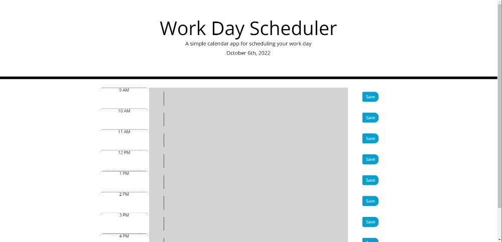

# Work Day Scheduler

## Description

A handy tool for saving tasks that need to be done in a 9-5 work day.

## Installation

Visit the site: https://darxmarx.github.io/work-day-scheduler/
 
Then type in tasks for whatever hours as needed, and hit the Save buttons.

## Usage 

This website is a simple, organized method of setting up a user's schedule for the day. The user may type in whatever they desire into whatever hours they choose, and then be able to save their scheduled events for later viewing on the site. In addition, each hour is color-coded--gray text boxes mean the hour has already passed, red text boxes mean the events should be accomplished during the user's current hour, and green text boxes mean the scheduled events have yet to happen.

## Screenshot

## Credits

N/A

## License

Please refer to the LICENSE in the repo.